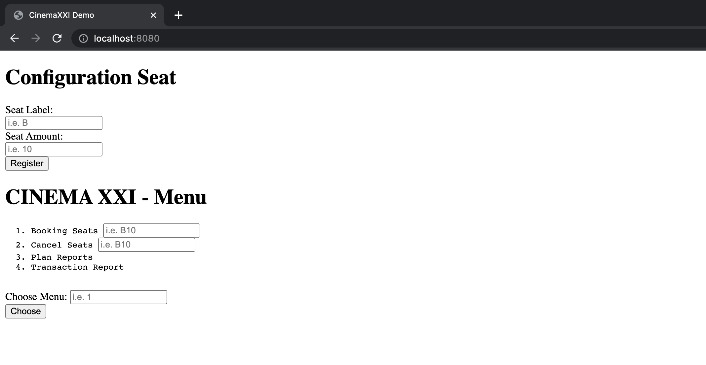
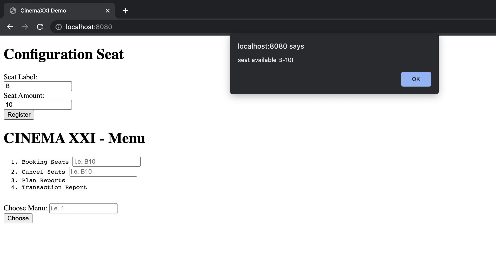
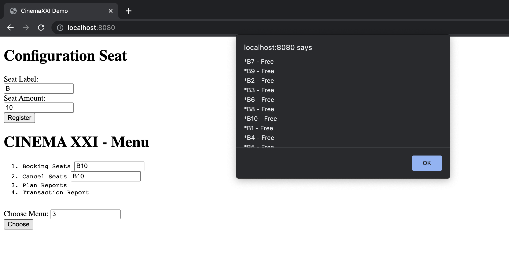
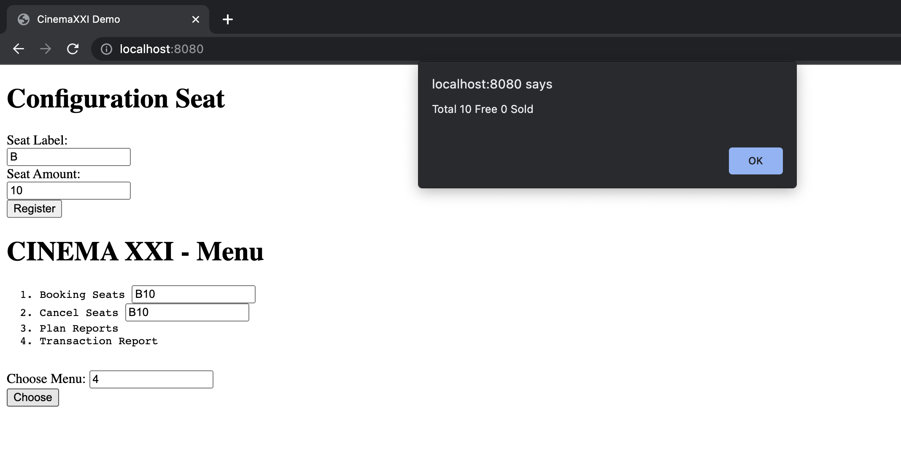

# CINEMA XXI - LAYOUT

CINEMA XXI - LAYOUT



## Run Project

### Run Go Mod Vendor

```bash
go mod vendor
```

### Run API Gateway

```bash
go run cmd\main.go
```

### Run CINEMA XXI - LAYOUT

```bash
OPEN localhost:8080 on browser
```

## Run Test

```bash
go test -v ./... -cover
```

## Example Request and Response

### Add Seat Configuration



### Booking Seat


### Cancel Seat


### Seat Status



### Transaction Status

